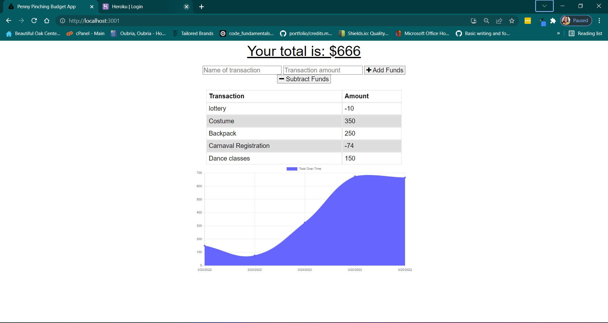
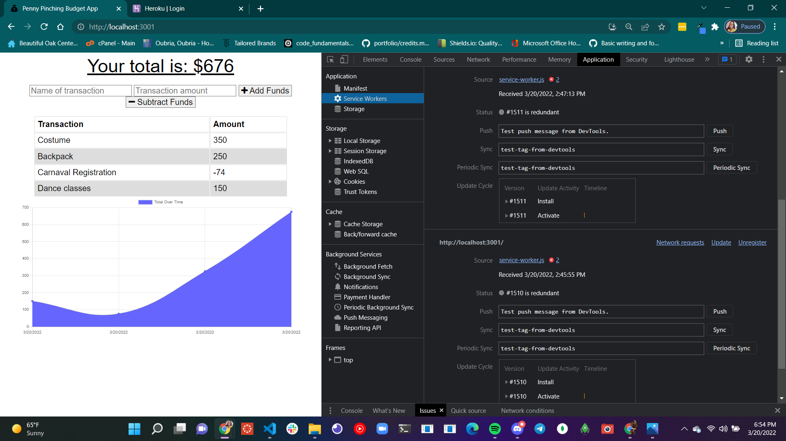
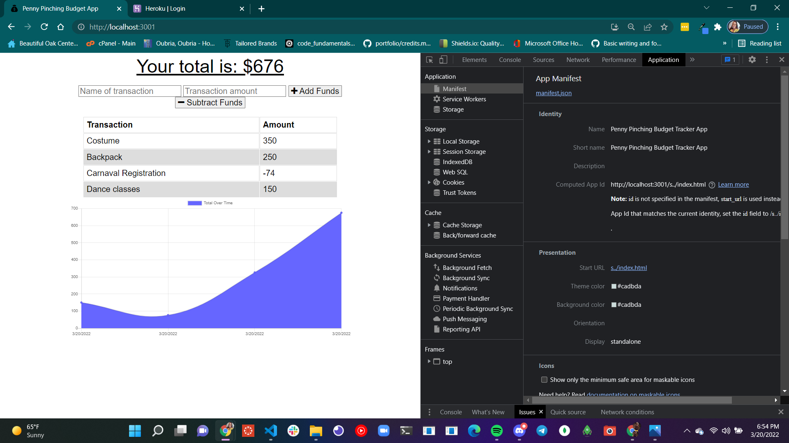

# 
PWA Penny Pinching Budget Tracker 

## Table of Contents
- [Description](#description) 
- [My-Task](#)
- [User-Story](#user-story)
- [Acceptance-Criteria](#acceptance-criteria)
- [Screenshots](#screenshots)
- 
- 
- [Built-With](#built-with)
- [Contact](#contact)

# Description
The Penny Pinching Budget Tracker allows the user to responsibly track spending habits. Permitting the user to keep accurate track of transactions, and deposits online or offline. Not missing a beat due to no connection. The convenience of being able to still enter a deposit and track an expense offline. Additionally, when back online those  offline entries are added to the Penny Pinching Budget Tracker.  
# My Task
Giving users a fast and easy way to track their money is important, but allowing them to access that information at any time is even more important. Having offline functionality is paramount to the success of an application that handles users’ financial information.

The challenge is to update an existing budget tracker application to allow for offline access and functionality. The user will be able to add expenses and deposits to their budget with or without a connection. If the user enters transactions offline, the total should be updated when they're brought back online. Once I’ve made these changes,I’ll deploy the application to Heroku.

# User Story
AS AN avid traveler
I WANT to be able to track my withdrawals and deposits with or without a data/internet connection
SO THAT my account balance is accurate when I am traveling 
# Acceptance Criteria
GIVEN a budget tracker without an internet connection
WHEN the user inputs an expense or deposit
THEN they will receive a notification that they have added an expense or deposit
WHEN the user reestablishes an internet connection
THEN the deposits or expenses added while they were offline are added to their transaction history and their totals are updated

# Screenshots

This screenshot demonstrates the functionality and serves as a visual aid.

Service-worker

Manifest

# Contact
[RogueStorm](https://roguestorm7.github.io/PWA-penny-pinching-budget-tracker/)🤳🏿👨🏿‍💻

&copy; 2022 Mianta McKnight ✌🏿📱 👨🏿‍💻| All rights reserved | 